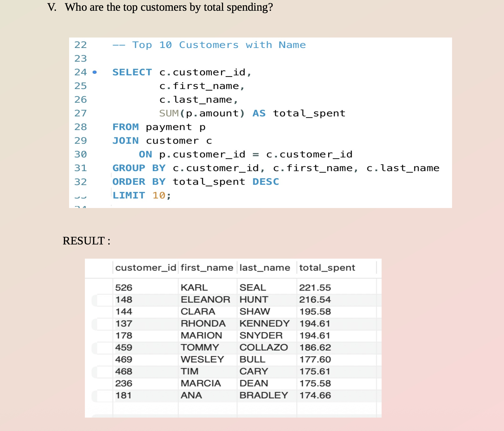
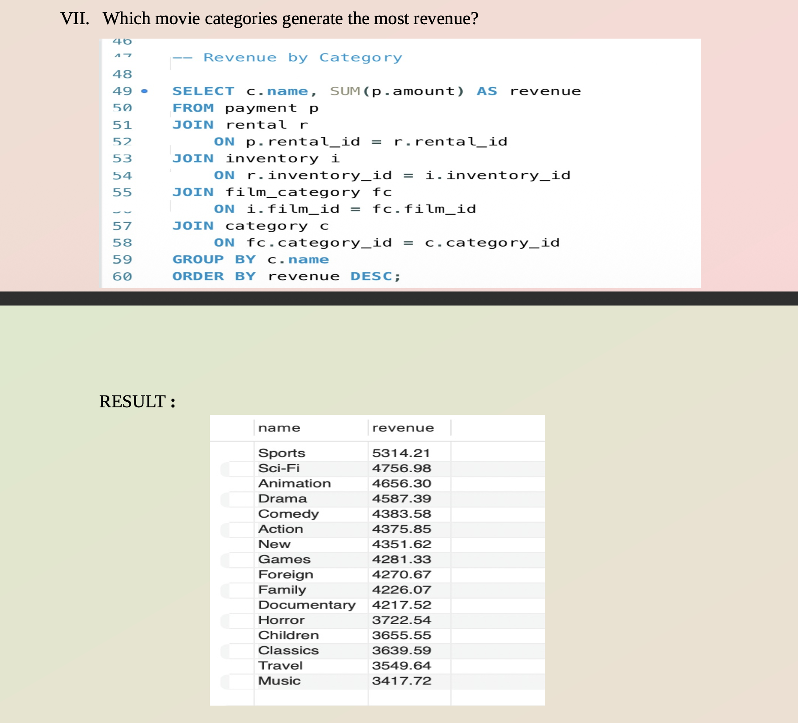
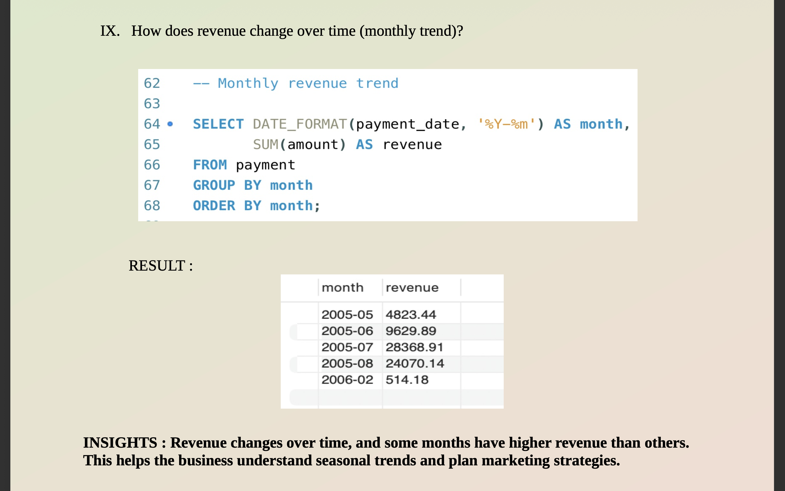

# 🎬 Sakila SQL Business Analysis

## 📌 Project Overview

A comprehensive SQL-based business analysis of the **Sakila movie rental database** — a real-world relational database representing a DVD rental store chain. The project extracts actionable business insights across customer behavior, revenue patterns, inventory performance, and seasonal trends using structured SQL queries.

---

## 🎯 Objectives

- Analyze customer behavior and identify top spenders
- Identify most rented movies and highest-revenue categories
- Compare store performance by revenue
- Study monthly rental and revenue trends to detect seasonality
- Generate data-driven business recommendations using SQL

---

## 🗂️ Dataset Description

The Sakila database represents a real-world movie rental business with fully relational tables:

| Table | Description |
|-------|-------------|
| `customer` | 599 customers with demographic details |
| `rental` | 16,044 rental transaction records |
| `payment` | Payment and revenue data |
| `film` | 1,000 movies across 16 categories |
| `inventory` | Store-level stock tracking |
| `category` | Movie genre classification |
| `staff` / `store` | Staff and store location details |

---

## 🛠️ Tools Used

| Tool | Purpose |
|------|---------|
| MySQL Workbench | Query writing and execution |
| SQL | Data analysis — JOINs, aggregations, GROUP BY, ORDER BY |

---

## 📈 Key Business Metrics

| Metric | Value |
|--------|-------|
| 👥 Total Customers | 599 |
| 🎟️ Total Rentals | 16,044 |
| 💰 Total Revenue | $67,407 |
| 🏪 Store 1 Revenue | $33,482 (49.7%) |
| 🏪 Store 2 Revenue | $33,924 (50.3%) |
| 📅 Peak Rental Month | July 2005 — 6,709 rentals |

---

## 🔍 Business Questions Answered

1. How many customers does the business have?
2. What is the total revenue generated?
3. Which store generates the most revenue?
4. Who are the top customers by total spending?
5. Which movies are rented the most?
6. Which movie categories generate the most revenue?
7. How many rentals happen each month?
8. How does revenue change over time?
9. Which actors appear in the most movies?
10. Which categories are rented the most?

---

## 💡 Key Insights

### 👥 Customer & Revenue
- **Top customer Karl Seal spent $221.55**, followed by Eleanor Hunt ($216.54) and Clara Shaw ($195.58)
- The top 10 customers account for a disproportionate share of total revenue — prime candidates for loyalty programs

### 🏪 Store Performance
- Store 2 ($33,924) marginally outperformed Store 1 ($33,482) — a difference of just **1.3%**, indicating balanced operational performance across both locations

### 🎬 Movie Performance
- **Bucket Brotherhood** was the most rented title with **34 rentals**, followed by Rocketeer Mother (33) and Ridgemont Submarine (32)
- Rental counts are tightly clustered (31–34), suggesting no single blockbuster dominates demand

### 📂 Category Revenue
- **Sports generated the highest revenue at $5,314** — 55% more than the lowest category, Music ($3,417)
- Top 4 revenue categories: Sports ($5,314) → Sci-Fi ($4,757) → Animation ($4,656) → Drama ($4,587)
- Despite having the most films, Sports also leads in rentals (1,179), confirming strong customer demand

### 📅 Seasonal Trends
- **July 2005 had 6,709 rentals** — nearly **6× May's 1,156** — indicating a strong summer demand spike
- Revenue followed the same pattern: July ($28,369) vs May ($4,823) — a **5.9× difference**
- Businesses should stock up inventory and run promotions ahead of summer months

---

## 📸 Screenshots

### Top 10 Customers by Spending

*Karl Seal leads with $221.55 in total spend*

### Revenue by Category

*Sports and Sci-Fi dominate revenue — Music and Travel are the weakest performers*

### Monthly Rental & Revenue Trends

*July shows a clear demand spike — 6× higher than May rentals*

---

## 🚀 Conclusion

This project demonstrates how SQL can extract high-value business insights from a relational database using JOINs across 6+ tables, aggregations, and trend analysis. Key findings include a strong summer seasonality pattern, near-equal store performance, and Sports as the dominant revenue category — all actionable insights for inventory planning, marketing, and customer retention strategy.

---

## 📁 Files in This Repository

| File | Description |
|------|-------------|
| `sakila_queries.sql` | All business analysis SQL queries |
| `SAKILA_SQL_PROJECT.pdf` | Full project report with results and insights |
| `*.png` | Screenshot outputs from query results |
